<div align="center">

# DrNoon Image Transform

[](https://www.python.org/downloads/release/python-370/)
[](https://black.readthedocs.io/en/stable/)
[](https://pycqa.github.io/isort/)
[](https://github.com/pre-commit/pre-commit)
[](https://github.com/medi-whale/drnoon-image-transform/actions/workflows/lint.yml)
[](https://github.com/medi-whale/drnoon-image-transform/actions/workflows/test.yml)

A General-Purpose Library for Image Transformations in DrNoon Components 🚀⚡🔥<br>

</div>

<!----------------------------------------------------------------------------
Installation
----------------------------------------------------------------------------->

# Installation

## From Source

### 1. By cloning the repository
```bash
git clone https://github.com/medi-whale/drnoon-image-transform.git
cd drnoon-image-transform
# Optionally, checkout a specific version tag.
pip install .
```

### 2. By pip installing from GitHub
Replace `x.y.z` with the desired version tag:
```bash
pip install git+https://github.com/medi-whale/drnoon-image-transform.git@x.y.z
```

## From GCP Artifact Registry (Recommended)

### 1. Ensure GCP authentication

#### 1.1. Using gcloud CLI
```bash
gcloud init
```

#### 1.2. Using service account credentials
```bash
export GOOGLE_APPLICATION_CREDENTIALS=/path/to/your/service-account-credentials.json
```

### 2. Install additional dependencies
You need to install "keyring" packages to enable pip to authenticate with GCP Artifact Registry:
```bash
pip install keyring keyrings.google-artifactregistry-auth
```

### 3. Install the package
Replace `x.y.z` with the desired version:
```bash
pip install --extra-index-url https://asia-northeast3-python.pkg.dev/woven-icon-386903/pypi/simple/ drnoon-image-transform==x.y.z
```

<!----------------------------------------------------------------------------
Single Image Transform
----------------------------------------------------------------------------->

# Single Image Transform

Transform a single image in a deterministic way specified by the given parameters.

## Usage

```python
import cv2
import numpy as np
import drnoon_image_transform as dit

# Define a transform
param = dit.TransformParam(
    precrop=1.0      # center precrop ratio to the original (e.g. 0.5, 1.0).
    circle_mask=True # whether to apply a center circular mask {True, False}
    scale=1.3,       # relative scale to the original (e.g. 0.5, 1, 2)
    aspect=0.7,      # relative aspect ratio (width/height) to the original (e.g. 0.7, 1, 1.3)
    rotate=45,       # rotation angle in degree (e.g. -45, 0, 45)
    translate_x=0.3, # relative translation to width (e.g. -0.3, 0, 0.3)
    translate_y=0.3, # relative translation to height (e.g. -0.3, 0, 0.3)
    shear_x=15,      # shearing angle in degree (e.g. -45, 0, 45)
    shear_y=-15,     # shearing angle in degree (e.g. -45, 0, 45)
    hflip=True,      # whether to flip horizontally {True, False}
    vflip=False,     # whether to flip vertically {True, False}
    brightness=0.3,  # relative brightness change to the original (e.g. -0.3, 0, 0.3)
    contrast=-0.3,   # relative contrast change to the original (e.g. -0.3, 0, 0.3)
)
transform = dit.Transform(
    param=param,
    target_shape=(100, 100)  # target image shape (height, width). If not given (or None), the original shape is preserved.
    normalize={"mean": [0.61, 0.24, 0.18], "std": [0.34, 0.15, 0.11]}  # mean and std for final normalization (scaled to [0, 1]). If not given (or None), no normalization is applied.
)

# Transform an image
transformed: np.ndarray = transform(image)
```

#### Color Transfer

You can change the color appearance of an image by a simple color transfer algorithm based on matching the pixel mean and standard deviation  ([Reinhard et al. 2001](https://users.cs.northwestern.edu/~bgooch/PDFs/ColorTransfer.pdf)).

```python
# Define the target RGB color space to transfer to.
target_color_space = dit.RGBColorSpace(
    mean={"r": 155, "g": 61, "b": 45},  # Or, mean=[155, 61, 45]
    std={"r": 86, "g": 37, "b": 27},  # Or, std=[86, 37, 27]
)
# You can also omit the mean and std,
# i.e. target_color_space = dit.RGBColorSpace() (or, target_color_space = {}),
# to use the default color space (mean=[155, 61, 45], std=[86, 37, 27]),
# which is empirically found for normal fundus images.

# Define a transform including the color transfer.
param = dit.TransformParam(
    color_transfer=target_color_space,
    # other parameters...
)
transform = dit.Transform(param=param)

# Prepare an RGB image.
image = cv2.imread("image.jpg")
image = cv2.cvtColor(image, cv2.COLOR_BGR2RGB)

# Transform an image
transformed: np.ndarray = transform(image)
```

## Examples

- `target_shape` is `(100, 100)`.
- `normalize` is not applied.
- `color_transfer` uses the default `RGBColorSpace()`.

#### Normal Fundus

|Original|
|---|
|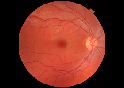|

|scale=1.3|scale=0.7|
|---|---|
|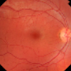||

|aspect=1.3|aspect=0.7|
|---|---|
|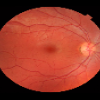|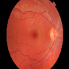|

|rotate=45|rotate=-45|
|---|---|
|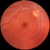|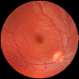|

|translate_x=0.3|translate_x=-0.3|translate_y=0.3|translate_y=-0.3|
|---|---|---|---|
|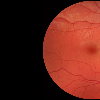|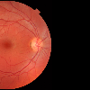|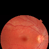|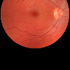|

|shear_x=15|shear_x=-15|shear_y=15|shear_y=-15|
|---|---|---|---|
|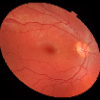|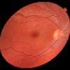|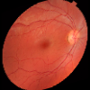|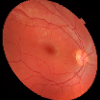|

|hflip|vflip|
|---|---|
|||

|brightness=0.3|brightness=-0.3|
|---|---|
|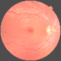|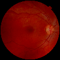|

|contrast=0.3|contrast=-0.3|
|---|---|
|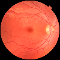|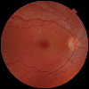|


#### Wide Fundus

|Original|
|---|
|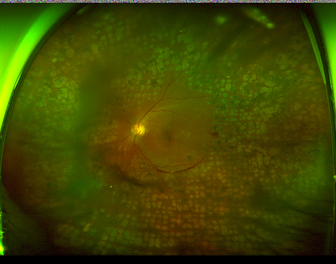|

|precrop=1.0|precrop=0.7|precrop=0.4|
|---|---|---|
|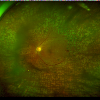|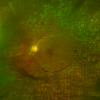|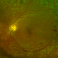|

|precrop=1.0<br>circle_mask|precrop=0.7<br>circle_mask|precrop=0.4<br>circle_mask|
|---|---|---|
|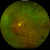|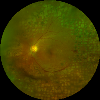|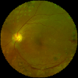|

|precrop=1.0<br>circle_mask<br>color_transfer|precrop=0.7<br>circle_mask<br>color_transfer|precrop=0.4<br>circle_mask<br>color_transfer|
|---|---|---|
|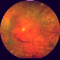|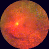|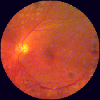|

|precrop=0.4<br>circle_mask<br>color_transfer<br>scale=1.3|precrop=0.4<br>circle_mask<br>color_transfer<br>scale=0.7|
|---|---|
|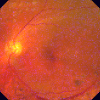|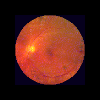|


<!----------------------------------------------------------------------------
Test-Time-Augmentation (TTA)
----------------------------------------------------------------------------->


# Test-Time-Augmentation (TTA)

Transform an image to multiple images by the given parameters. It is useful for Test-Time Augmentation (TTA) in AI model inference.

## Usage

```python
# Define a TTA
param = dit.TTAParam(
    precrop=[0.35],
    circle_mask=[True],
    scale=[0.7, 1, 1.3],
    rotate=[-60, -30, 0, 30, 60],
    hflip=[False, True],
    # ...
    # parameters are the same as the single image transform, but each of them is a list of values.
)
tta = dit.TTA(
    param=param,
    # you can also specify target_shape and normalize in the same way as the single image transform.
)

# Apply TTA to an image.
# It produces a list of transformed images for every possible parameter combination.
# i.e. 30 images in this case (3 scales x 5 rotations x 2 flips).
transformed_images: List[np.ndarray] = tta(image)
```

## Examples

- `target_shape` is `(100, 100)`.
- `normalize` is not applied.

|Original|
|---|
||

```python
param = dit.TTAParam(
    scale=[0.7, 1.3],
    rotate=[-45, 0, 45],
    hflip=[False, True],
)
```
will produce 12 transformed images (2 scales x 3 rotations x 2 flips):

|scale=0.7, rotate=-45, hflip=False|scale=0.7, rotate=-45, hflip=True|scale=0.7, rotate=0, hflip=False|scale=0.7, rotate=0, hflip=True|scale=0.7, rotate=45, hflip=False|scale=0.7, rotate=45, hflip=True|
|---|---|---|---|---|---|
|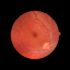|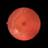|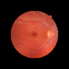|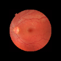|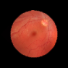|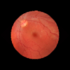|

|scale=1.3, rotate=-45, hflip=False|scale=1.3, rotate=-45, hflip=True|scale=1.3, rotate=0, hflip=False|scale=1.3, rotate=0, hflip=True|scale=1.3, rotate=45, hflip=False|scale=1.3, rotate=45, hflip=True|
|---|---|---|---|---|---|
|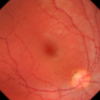|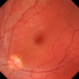||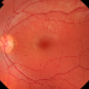|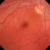|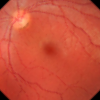|


<!----------------------------------------------------------------------------
Random Augmentation
----------------------------------------------------------------------------->


# Random Augmentation

Transform a single image in an indeterministic way by randomly sampling the given parameters. It is useful for data augmentation in AI model training.
There are 4 categories of augmentation parameters: pre-augmentation (`preaug`), geometric augmentation (`geometric`), photometric augmentation (`photometric`), and post-augmentation (`postaug`).

### Pre-Augmentation
- `precrop`: Range of center precrop ratio to the original (e.g. `[0.5, 1.0]`).
- `circle_mask`: Probability of applying a center circular mask (e.g. `0.5`).

### Geometric Augmentation
- `scale`: Range of relative scale to the original (e.g. `[0.7, 1.3]`).
- `aspect`: Range of relative aspect ratio (width/height) to the original (e.g. `[0.7, 1.3]`).
- `rotate`: Range of rotation angle in degree (e.g. `[-45, 45]`).
- `translate_x`: Range of relative translation to width (e.g. `[-0.3, 0.3]`).
- `translate_y`: Range of relative translation to height (e.g. `[-0.3, 0.3]`).
- `shear_x`: Range of shearing angle in degree (e.g. `[-45, 45]`).
- `shear_y`: Range of shearing angle in degree (e.g. `[-45, 45]`).
- `hflip`: Probability of flipping horizontally (e.g. `0.5`).
- `vflip`: Probability of flipping vertically (e.g. `0.5`).

### Photometric Augmentation
For every photometric augmentation, the name of the parameter is the same as the name of a certain [Albumentations](https://albumentations.ai/docs/api_reference/augmentations/transforms/) transform (but in snake_case), and the value is a dictionary of the corresponding parameters. For example, `blur={"blur_limit": 3, "p": 0.1}` corresponds to [`Blur(blur_limit=3, p=0.1)`](https://albumentations.ai/docs/api_reference/augmentations/blur/transforms/#albumentations.augmentations.blur.transforms.Blur). The photometric transforms run in a random order each time for increasing randomness.

**Color**

- `color_jitter`: A dictionary of [ColorJitter](https://albumentations.ai/docs/api_reference/augmentations/transforms/#albumentations.augmentations.transforms.ColorJitter) parameters.
- `random_brightness_contrast`: A dictionary of [RandomBrightnessContrast](https://albumentations.ai/docs/api_reference/augmentations/transforms/#albumentations.augmentations.transforms.RandomBrightnessContrast) parameters.
- `random_gamma`: A dictionary of [RandomGamma](https://albumentations.ai/docs/api_reference/augmentations/transforms/#albumentations.augmentations.transforms.RandomGamma) parameters.

**Degradation**

- `blur`: A dictionary of [Blur](https://albumentations.ai/docs/api_reference/augmentations/blur/transforms/#albumentations.augmentations.blur.transforms.Blur) parameters.
- `gaussian_blur`: A dictionary of [GaussianBlur](https://albumentations.ai/docs/api_reference/augmentations/blur/transforms/#albumentations.augmentations.blur.transforms.GaussianBlur) parameters.
- `median_blur`: A dictionary of [MedianBlur](https://albumentations.ai/docs/api_reference/augmentations/blur/transforms/#albumentations.augmentations.blur.transforms.MedianBlur) parameters.
- `motion_blur`: A dictionary of [MotionBlur](https://albumentations.ai/docs/api_reference/augmentations/blur/transforms/#albumentations.augmentations.blur.transforms.MotionBlur) parameters.
- `zoom_blur`: A dictionary of [ZoomBlur](https://albumentations.ai/docs/api_reference/augmentations/blur/transforms/#albumentations.augmentations.blur.transforms.ZoomBlur) parameters.
- `defocus_blur`: A dictionary of [DefocusBlur](https://albumentations.ai/docs/api_reference/augmentations/blur/transforms/#albumentations.augmentations.blur.transforms.DefocusBlur) parameters.
- `downscale`: A dictionary of [Downscale](https://albumentations.ai/docs/api_reference/augmentations/transforms/#albumentations.augmentations.transforms.Downscale) parameters.
- `image_compression`: A dictionary of [ImageCompression](https://albumentations.ai/docs/api_reference/augmentations/transforms/#albumentations.augmentations.transforms.ImageCompression) parameters.
- `posterize`: A dictionary of [Posterize](https://albumentations.ai/docs/api_reference/augmentations/transforms/#albumentations.augmentations.transforms.Posterize) parameters.
- `solarize`: A dictionary of [Solarize](https://albumentations.ai/docs/api_reference/augmentations/transforms/#albumentations.augmentations.transforms.Solarize) parameters.

**Enhancement**

- `sharpen`: A dictionary of [Sharpen](https://albumentations.ai/docs/api_reference/augmentations/transforms/#albumentations.augmentations.transforms.Sharpen) parameters.
- `equalize`: A dictionary of [Equalize](https://albumentations.ai/docs/api_reference/augmentations/transforms/#albumentations.augmentations.transforms.Equalize) parameters.
- `clahe`: A dictionary of [CLAHE](https://albumentations.ai/docs/api_reference/augmentations/transforms/#albumentations.augmentations.transforms.CLAHE) parameters.

**Noise**

- `gauss_noise`: A dictionary of [GaussNoise](https://albumentations.ai/docs/api_reference/augmentations/transforms/#albumentations.augmentations.transforms.GaussNoise) parameters.
- `iso_noise`: A dictionary of [ISONoise](https://albumentations.ai/docs/api_reference/augmentations/transforms/#albumentations.augmentations.transforms.ISONoise) parameters.
- `multiplicative_noise`: A dictionary of [MultiplicativeNoise](https://albumentations.ai/docs/api_reference/augmentations/transforms/#albumentations.augmentations.transforms.MultiplicativeNoise) parameters.

**Custom**

- `gaussian_blackout`: A dictionary of [GaussianBlackout](drnoon_image_transform/utils/custom_albumentations.py) parameters.
- `fundus_contrast_enhancement`: A dictionary of [FundusContrastEnhancement](drnoon_image_transform/utils/custom_albumentations.py) parameters.


### Post-Augmentation

- `coarse_dropout`: A dictionary of [CoarseDropout](https://albumentations.ai/docs/api_reference/augmentations/transforms/#albumentations.augmentations.transforms.CoarseDropout) parameters.

## Usage

```python
param = dit.RandomAugParam(
  preaug={
    "precrop": [0.2, 0.5],
    "circle_mask": 0.5,
  }
  geometric={
    "scale": [0.7, 1.3],
    "hflip": 0.5,
    # ...
  },
  photometric={
    "color_jitter": {"brightness": 0.3, "contrast": 0.3, "saturation": 0.3, "hue": 0.3, "p": 0.9},
    "blur": {"p": 0.1},
    # ...
  },
  postaug={
    "coarse_dropout": {"max_holes": 16, "max_height": 8, "max_width": 8, "p": 0.5},
  },
)
augmentation = dit.RandomAugmentation(
    param=param,
    target_shape=(512, 512),  # target image shape (height, width). If not given (or None), the original shape is preserved.
    normalize={"mean": [0.61, 0.24, 0.18], "std": [0.34, 0.15, 0.11]},  # mean and std for final normalization (scaled to [0, 1]). If not given (or None), no normalization is applied.
)
augmented_image: np.ndarray = augmentation(image)
```

### Using Predefined Parameters

We provide some [predefined parameters](drnoon_image_transform/utils/predefined_params.py) for common use cases. For example, for PyTorch model training and testing:

```python
# Training
if normal_fundus:
    aug_param = dit.FUNDUS_RANDOM_AUG_PARAM  # various random augmentations
elif wide_fundus:
    aug_param = dit.WIDE_RANDOM_AUG_PARAM  # added precrop and circle_mask

# You can finetune the parameters if needed. e.g.
# aug_param.geometric.scale = [1, 1]
# aug_param.photometric.coarse_dropout = {"p": 0}

augmentation = dit.RandomAugmentation(
    param=aug_param,
    target_shape=(...),  # your target image shape
    normalize={...},  # your normalization parameters
)
image = augmentation(image)
image = torch.from_numpy(image)
```

```python
# Testing
if normal_fundus:
    transform_param = {}  # no transform
elif wide_fundus:
    transform_param = dit.WIDE_TRANSFORM_PARAM  # precrop and circle_mask

# You can also finetune the parameters if needed. e.g.
# transform_param.scale = 1.2

transform = dit.Transform(
    param=transform_param,
    target_shape=(...),  # your target image shape
    normalize={...},  # your normalization parameters
)
image = transform(image)
image = torch.from_numpy(image)
```


### Using Kornia for GPU-Accelerated Transformations


[Kornia](https://kornia.readthedocs.io/en/latest/) enables GPU-accelerated image transformations. This section explains how to use Kornia for applying both geometric and photometric transformations. In this library, geometric transformations and specific photometric transformations that are not compatible with Kornia are computed on the CPU. Meanwhile, other photometric transformations and post-transformations, which can be efficiently processed by Kornia, utilize the GPU to enhance speed.

Photometric Transform Arguments Compatible with Kornia for GPU
The following arguments specify photometric transformations that are compatible with Kornia, allowing for efficient GPU processing
```python
photometric=tp.PhotoAugParam(
    color_jitter={"brightness": 0.3, "contrast": 0.3, "saturation": 0.3, "hue": 0.3, "p": 0.5},
    posterize={"bits": [4, 8], "p": 0.05},
    solarize={"p": 0.05},
    sharpen={"p": 0.05},
    equalize={"p": 0.05},
    fundus_contrast_enhancement={"p": 0.05},
)
```

Applying the Transformations
Here's how to define and apply transformations on an image. The example uses the CPU for certain transformations, with subsequent photometric and post-transformations processed on the GPU.

```python

# Define a cpu transform with parameters before using Kornia and this transform will be applied at CPU.
cpu_param = dit.CPU_FUNDUS_RANDOM_AUG_PRE_KORNIA_PARAM
cpu_transform = dit.RandomAugmentation(param=cpu_param)

# Define a gpu transform using kornia and this transform can be applied at GPU.
gpu_param = dit.GPU_FUNDUS_RANDOM_AUG_KORNIA_PARAM
gpu_transform = dit.RandomAugmentationKornia(param=gpu_param)

# Transform an loaded image
transformed: np.ndarray = transform(image)

# The transformed array will be a batch of images, also permuted, and then moved to the GPU.

# Before the model's forward pass, apply some photometric and post-transformations.
images : torch.Tensor = images / 255.0  # tensor must be normalized in 0 ~ 1 for kornia
images : torch.Tensor = gpu_transform(images)
outputs = model(images)
```

## Examples

- `target_shape` is `(100, 100)`.
- `normalize` is not applied.
- The predefined parameters are used.
- Note: some of the examples (such as `blur`s) might be seen too strong, but it is because of the small image resolution. It will be more natural in higher resolution (e.g. `(512, 512)`).

### Original


### scale
 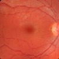 

### aspect
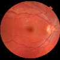 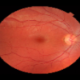 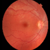

### rotate
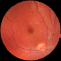 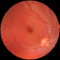 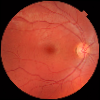

### translate_x
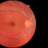 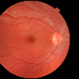 

### translate_y
  

### shear_x
  

### shear_y
  

### hflip
  

### vflip
  

### color_jitter
  

### random_brightness_contrast
  

### random_gamma
  

### blur
  

### gaussian_blur
  

### median_blur
  

### motion_blur
  

### zoom_blur
  

### defocus
  

### downscale
  

### image_compression
  

### posterize
  

### solarize
  

### sharpen
  

### equalize
  

### clahe
  

### gauss_noise
  

### iso_noise
  

### multiplicative_noise
  

### gaussian_blackout
  

### fundus_contrast_enhancement
  

### coarse_dropout
  

### All Together!
    

    


# DicomConverter

Convert Dicom to Image using pydicom handlers

## Usage

```python
# Define a converter

dcm_file = dcmread('test.dcm')
dicomConverter = dit.DicomConverter()
np_image = dicomConverter(dcm_file)

```
